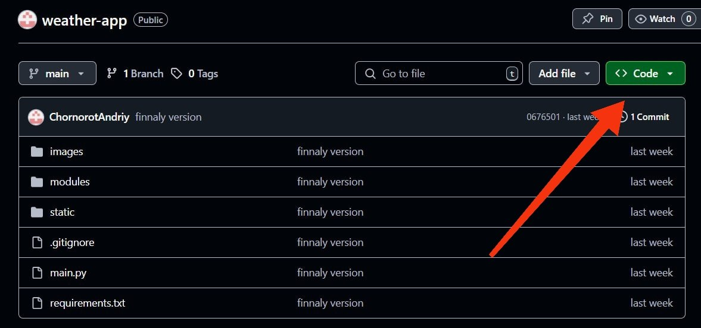
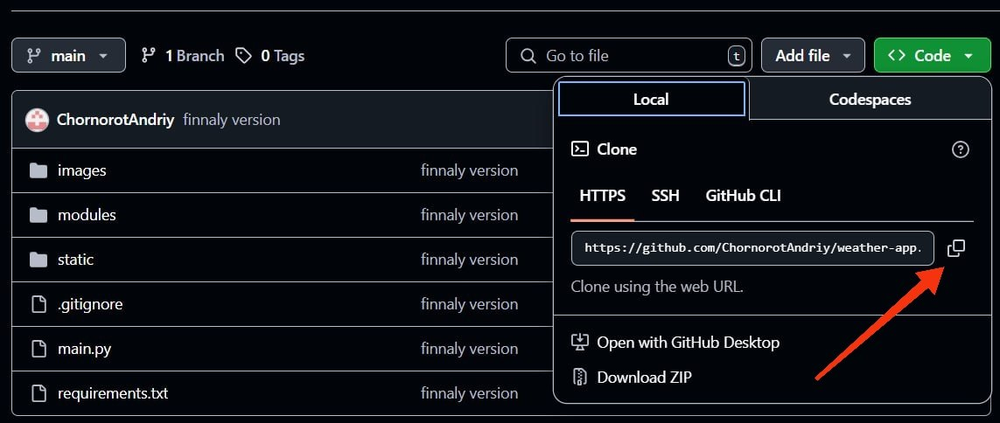
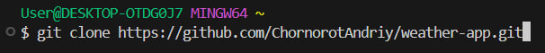
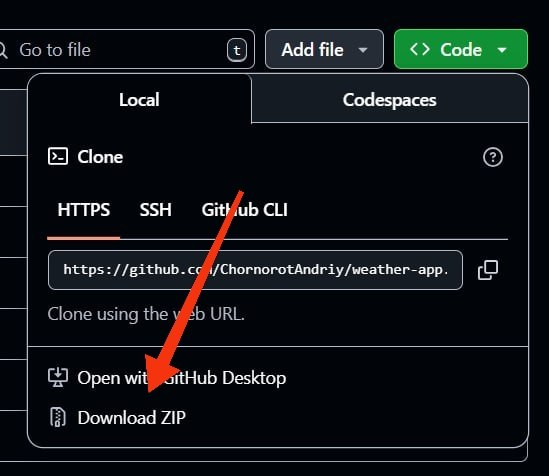

# Weather application

Цей проект розроблено з метою ознайомлення із роботою API, принципом отримання даних від віддаленого серверу, вмінням їх обробляти, структурувати та застосовувати у своємо проєкті. А саме застосовувалось API такого веб-ресурсу як [OpenWeatherMap](https://openweathermap.org). Проєкт допоможе розібратися із роботою файлів JSON, як правильно отримувати та зберігати дані у файлах з типом .json. Та познайомити користувача з інтерфейсом застосунку розробленим за допомогою пакету [CustomTkinter](https://customtkinter.tomschimansky.com)

### Зміст репозиторія:

1. [Основні модулі проєкту](#all-modules)
2. [Розгортання проєкту](#download-project)
3. [Створення віртуального оточення проєкту](#create-venv)
4. [Завантаження модулів до віртуального оточення](#download-modules-venv)
5. [Старт проєкту](#start-project)
6. [Основні механіки проєкту](#all-mechanics)
7. [Висновок по проєкту](#result) 
___
<h4 id= 'all-modules'>Основні модулі проєкту:</h4>
All modules

- [customtkinter](https://customtkinter.tomschimansky.com/)
- [json](https://docs.python.org/3/library/json.html)
- [requests](https://requests.readthedocs.io/en/latest/)
- [pillow](https://pillow.readthedocs.io/en/stable/)
- [os](https://docs.python.org/3/library/os.html)
- [colorama](https://pypi.org/project/colorama/)
- [datetime](https://docs.python.org/3/library/datetime.html)
___
<h4 id= 'download-project'>Розгортання проєкту:</h4>
Download project

1. Склонувати з Git Hub репозиторію
    - 1. Натиснути на зелену кнопку Code 
    - 2. Натиснути на знак скопіювати біля посилання 
    - 3. Відкрити термінал та вставити скопійоване посилання разом з командою git clone 

2. Завантажити за допомогою zip-архіву
    - 1. Натиснути зелену кнопку Code 
    - 2. Натиснути на кнопку Download ZIP 
    - 3. Розархівувати завантажений файл у зручному для Вас місці
    ___
<h4 id= 'create-venv'>Створення віртуального оточення проєкту:</h4>
Сreate venv

1. Windows
    - 1. У терміналі вписати команду python -m venv venv - ця команда створює віртуальне оточення
    - 2. Написати команду venv/Scripts/activate - активування віртуального оточення

2. Mac OS або Linux
    - 1. У терміналі вписати команду python3 -m venv venv 
    - 2. Написати команду venv/bin/activate
___
<h4 id= 'download-modules-venv'>Завантаження модулів до віртуального оточення:</h4>
Download modules venv

1. Окремими модулями
    -Вписати у термінал команду:
    - Windows: pip install customtkinter requests pillow colorama darkdetect packaging datetime
    - Mac OS / Linux: pip3 install customtkinter requests pillow colorama darkdetect packaging datetime
2. За допомогою файлу requirements.txt
    - Windows: pip install -r requirements.txt
    - Mac OS / Linux: pip install -r requirements.txt
___
<h4 id= 'start-project'>Старт проєкту:</h4>
Start project

    - Прописати у терміналі: python main.py 
    (або python3 main.py)
___

<h4 id= 'all-mechanics'>Основні механіки проєкту:</h4>
All mechanics

    1.    Можливість отримати погодні данні для будь-якого міста за допомогою api
    2.    Можливість швидко переглядати температуру та погоду у багатьох містах
    3.    Зручний інтерфейс за допомогою customtkinter

___
<h4 id= 'result'>Висновок по проєкту:</h4>

Result

Над проєктом працював [Чорнорот Андрій](https://github.com/ChornorotAndriy)
Для прикладу використовувався api [openweathermap](https://openweathermap.org/)

  _У цьому проєкті я навчився користуватися багатьом технологіям у Python, такі як: обробка JSON-данних, робота з api запитами, pillow, requests та створення графічного інтерфейсу за допомогою customtkinter.
   Окрім цього, можна ще додати: відчувається як (з урахуванням вологості), інформацію про вітер(напрямок та швидкість), індекс забруднення повітря та тиск.
    Під час проєктування, я навчився використовувати графічний дизайнер Figma і навчився створювати базові деталі, позиціонувати елементи та використовувати їх при напісанні коду
    Я вважаю, що цей проєкт може буде користним не тільки для користувачів, але і для розробників_
